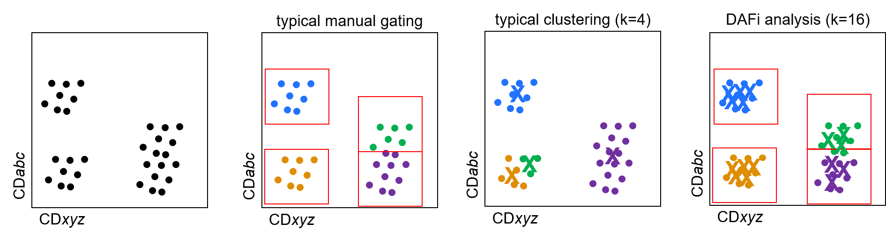
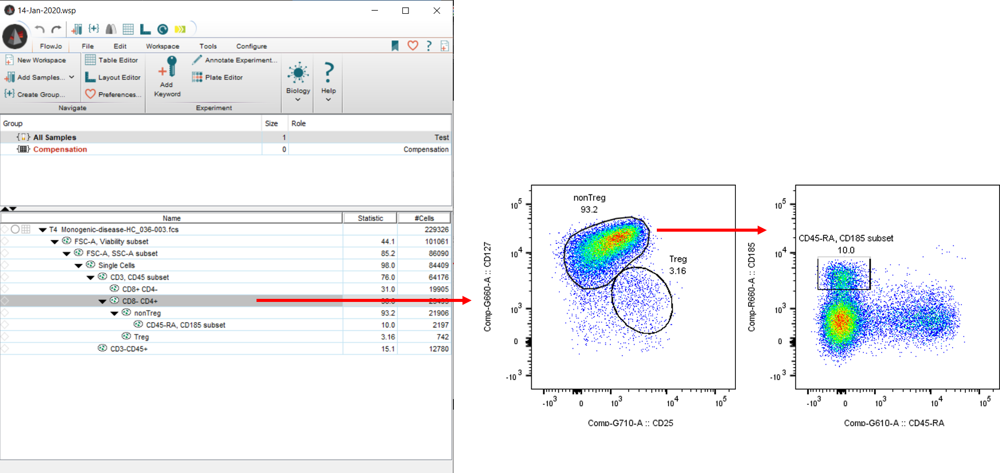
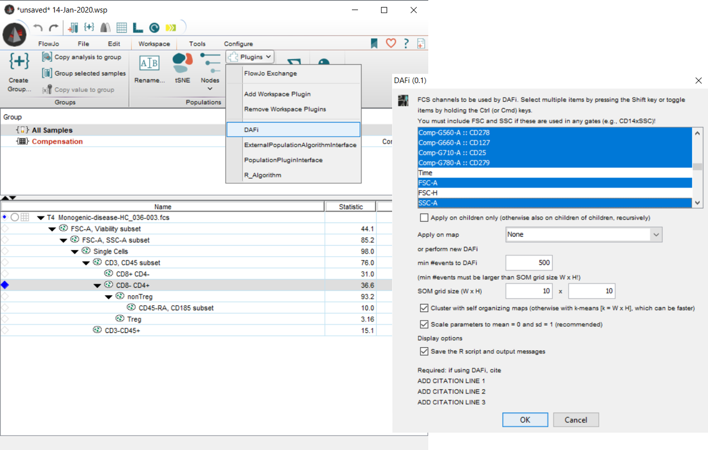
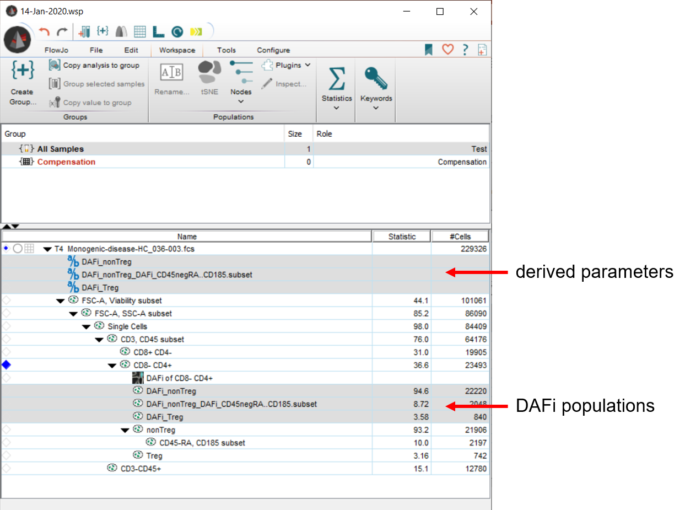
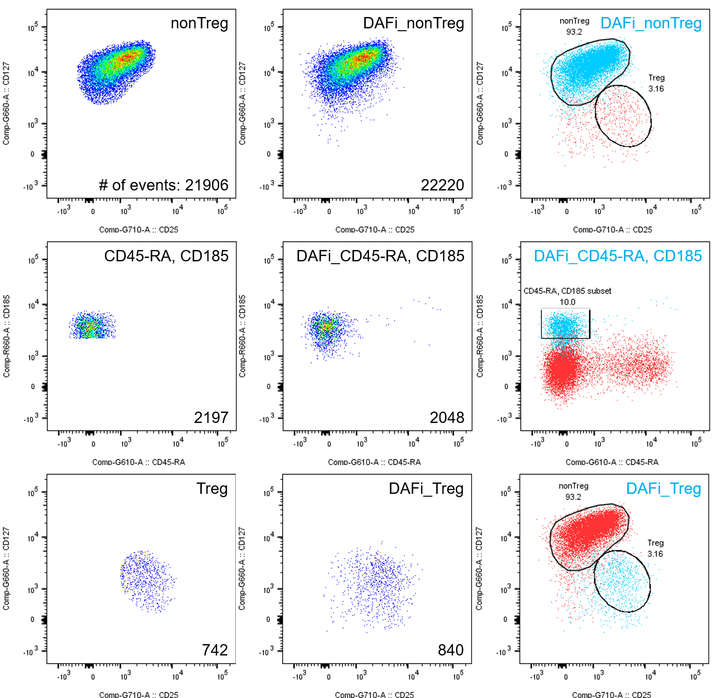

# Overview

Our new FlowJo plugin for DAFi bridges automated clustering techniques and human-driven gating strategies. DAFi stands for **D**irected **A**utomated **F**iltering and **I**dentification of cell populations in polychromatic flow cytometry data. The major feature of DAFi is its ability to control unsupervised clustering tools for the identification of previously known populations of interest in high-dimensional flow cytometry datasets. Among other many advantages, DAFi-derived gating results follow a much more natural distribution of the data. For more details, please see: [https://doi.org/10.1002/cyto.a.23371]( https://doi.org/10.1002/cyto.a.23371). 

# Obtaining the plugin

To be able to use this plugin, please install R (see [instructions](https://cran.r-project.org/)). Only R version 3.6.2 or newer can run the plugin.

On a mac, please install [XCode](https://apps.apple.com/us/app/xcode/id497799835?mt=12) and [gfortran](https://github.com/fxcoudert/gfortran-for-macOS/releases).

On windows, besides installing [R base](https://cran.r-project.org/bin/windows/base/), you may also have to install [Rtools](https://cran.r-project.org/bin/windows/Rtools/). 

On both mac and windows, please setup FlowJo to recognize R. There are easy-to-follow instructions [here](http://docs.flowjo.com/d2/plugins/installing-plugins/) under "*"Installing the R statistical computing environment"*".

Now, download the file [**DAFi.jar**](https://github.com/PedroMilanezAlmeida/DAFi/raw/master/DAFi.jar) and copy it to FlowJo's plugin folder as described [here](http://docs.flowjo.com/d2/plugins/installing-plugins/).

Don't forget to restart FlowJo before you can use the new plugin.

<!---  (Give it try! Just download the __DAFi.jar__ file above (soon you will also find it on [FlowJo's Plugin page](https://www.flowjo.com/exchange/#/)) and copy the file to your FlowJo plugins folder! Don't forget to restart FlowJo before using a new plugin.) --->

# Short Intro

Under the hood, the FlowJo plugin extracts the manual gating strategy from FlowJo to set the boundaries of regions of interest in the parameter hyperspace. Then, it gates on learned cluster centroids located in the regions of interest and finds all cells whose nearest neighbors are centroids of interest. Finally, the plugin automatically gates each cell according to their updated identities, returning them to the FlowJo workspace.

## Motivation

With the advent of high dimensional single cell interrogation technologies, bidimensional manual gating became obsolete. This led to a quick rise in the number of automatic clustering algorithms for biological and immunological research but several problems are associated with automated gating strategies, such as:

* Combining automated data analysis with human knowledge about gene/protein expression levels in specific cell types that perform a certain function of interest.
* Validate the results of automatic clustering.
* Dealing with batch effects. If manual gating is used, one can subjectively (or semi-automatically) shift a gate, but if clustering is used, one often finds new “populations”.

DAFi tries to solve some of these problems. The basic idea behind DAFi is to gate the centroids of clustering results with the manual gating strategy and update single cell identity according to within which gate the nearest neighboring centroid is located, if any.

The algorithm works like this:

* Cluster single cells using a high number of clusters;
* Gate the cluster centroids using manual gates;
* Merge clusters if their centroids are inside a given gate;
* Cells whose nearest neighbors is one of merged clusters belong to one merged population.

**Fig1**: How DAFi aims at bridging manual gating and automated clustering techniques.

## Reported advantages of DAFi

Several advantages of DAFi have been reported (see [original publication]( https://doi.org/10.1002/cyto.a.23371)):

* Better separation of poorly-resolved populations
* Abrupt cut in manual gating vs “natural” shape of data distribution in DAFi
* Higher interpretability of automated clustering
* When used recursively, higher chances of finding smaller populations than in automated clustering
* Effective use of human knowledge in guiding automated algorithms

## ezDAFi in action: DAFi from inside Flowjo

Our new implementation of DAFi relies on R and several R packages, in particular flowWorkspace and FlowSOM, to bring DAFi to FlowJo in the form of an easy-to-use plugin.

The plugin automatically imports single-cell data and FlowJo-derived gating strategies into R, builds single cell representations with either self-organizing maps (SOM, preferable) or k-means, and updates single cell identities according to the location of their nearest cluster centroid within the gating tree. The plugin can be used to refine gated populations in FlowJo, allowing for the visual check and re-use of DAFi gated cells in downstream analysis, such as building stats and plots. 

While building the gating tree, the user can select a parent population, call the plugin and refine all of its child populations using DAFi.

**Fig2**: Selecting "Single Cells" and running the plugin will refine either all gates down the hierarchy from "Single Cells" or only the immediate children, depending on user input. In this case, we only show one example of one immediate child gate, the "CD3, CD45 subset". Please note how the DAFi-refined population shows a much more natural distribution of the parameters after gating.

The user can also  build the whole gating tree first and then apply DAFi to a upstream population for the plugin to refine all children and children of children of that population. This feature allows for DAFi to be used recursively throughout several levels of the gating tree without additional human interaction. This way, all sub-populations downstream of the selected gate will be refined by DAFi.

## Conclusion

Our new plugin brings the power of DAFi to FlowJo, the most widely used single cell flow cytometry data analysis platform. This new implementation allows for the use of DAFi on the fly, giving the user the flexibility to re-use DAFi-refined populations with any of FlowJo's downstream analysis capabilities.

## Notes, Source and How To Use

#### Processing time

* Depends on the number of centroids to be used;
* First run can take a few minutes to install required R packages.

#### Known Bugs

* DAFi-ing children of DAFi gates does not work. The plugin creates derived parameters (zeros and ones), which are used to DAFi-gate cells in FlowJo. FlowJo-derived parameters are not imported into flowWorkspace in R, such that DAFi gates are not recognized in R for DAFi analysis of children of DAFi gates.
* Every DAFi-gate generates one derived parameter, overpopulating the view.

# Visual Guide With an Example

Population that we will cluster: CD8-CD4+.

Gates that we will refine with DAFi:

* "nonTreg"
* "CD45-RA, CD185 subset" among nonTregs
* "Treg"

After selecting population of interest, click on "Workspace", "plugins" and "DAFi". Select parameters for clustering among other options.

After hitting OK, the plugin runs for a few seconds (about 10-20sec for default number of clusters; the first run may take a few minutes to install packages; when running on a Mac for the first time, the user will need to instal [XCode](https://apps.apple.com/us/app/xcode/id497799835?mt=12) and [gfortran](https://github.com/fxcoudert/gfortran-for-macOS/releases) [see installation instructions above]).

Derived parameters and gated populations are imported back into FlowJo automatically. Please note how the plugin ran DAFi on the whole tree down from "CD8-CD4+" (this behavior can be turned off to DAFi only the immediate children).

DAFi populations behave just like FlowJo native populations! They can be plotted, gated, used in layouts and stats! Please note, however, that one cannot call the plugin on a child or grandchild of a previous DAFi gate, yet.

